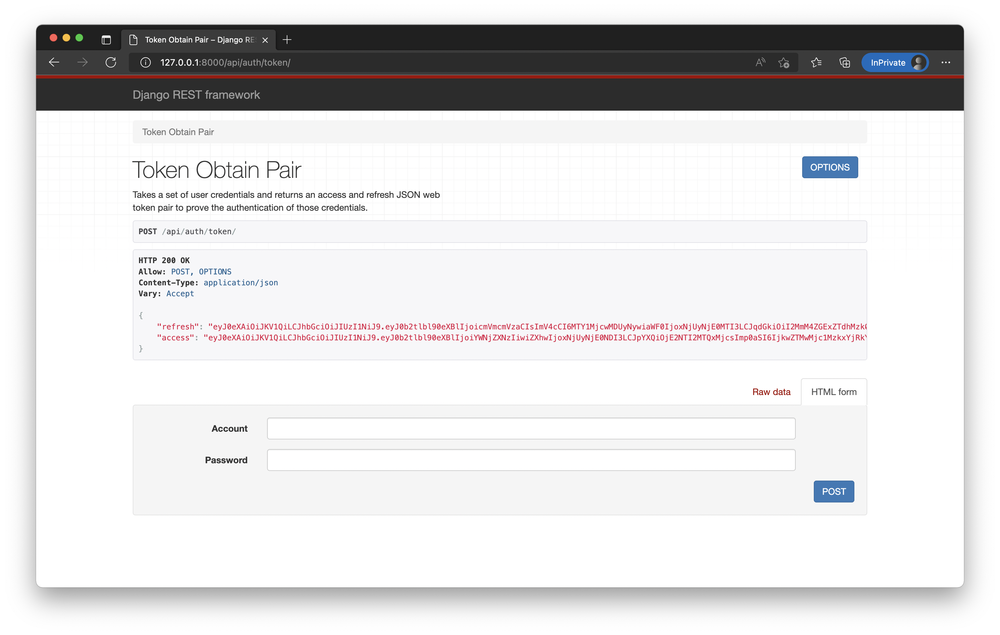

# custom-drf-jwt

- 第二個 commit ```建立 django project```
- 第三個 commit
    - 加入 rest-framework
    - 加入 rest-framework-simple-jwt
    - 加入 app_auth/urls.py 後，讓 core/urls.py 可以查看 app_auth/urls.py 的 URL
- 第四個 commit ```關鍵```
    - 加入 core/settings.py 125 行，更改預設的 user models
    - 增加 app_auth/models.py user(AbstractUser), 主要讓我們自定義使用者的欄位
      - None 為預設的欄位，我們系統不需要，用成 None 後 Django 將不會生成欄位
      - 將預設登入的帳號欄位 - username，改為 account
    - 增加 app_auth/models.py user_manager, 讓我們可以透過 ```createsuperuser``` 建立角色到自定義的 user models
    
# 執行

基本上因爲沒有前端建立使用者，所以就直接

```
pip install -r requirements.txt
python manage.py makemigrations
python manage.py migrate

python manage.py createsuperuser 
^^^ 這邊建立完使用者才可以測試 /api/auth/token/ ^^^ 

python manage.py runserver
```

# 完成

